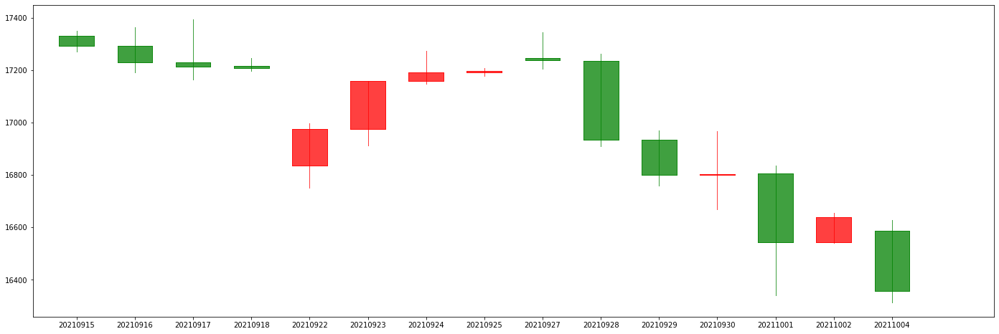

# FinTech HW1

## How to run

open `hw1.ipynb` in Jupyter Notebook and run all cells.

## Time bar



### Code Description

initialize data columns

```python
date = list(data['成交日期'].unique())
open = []
high = []
low = []
close = []
volume = []
```

將每個日期的資料放入各個list中

```python
df_day = pd.DataFrame(columns=['date', 'open', 'high', 'low', 'close', 'volume'])
for i in date:
    high.append(data[data['成交日期'] == i]['成交價格'].max())
    low.append(data[data['成交日期'] == i]['成交價格'].min())
    open.append(data[data['成交日期'] == i]['成交價格'].iloc[0])
    close.append(data[data['成交日期'] == i]['成交價格'].iloc[-1])
    volume.append(data[data['成交日期'] == i]['成交數量(B+S)'].sum())
```

將各個list傳入dataframe

```python
df_day['date'] = date
df_day['open'] = open
df_day['high'] = high
df_day['low'] = low
df_day['close'] = close
df_day['volume'] = volume
```

重置index

```python
df_day.index = df_day['date']
df_day.sort_index(inplace=True)
```

畫圖

```python
fig = plt.figure(figsize=(24, 8))
ax = fig.add_subplot(1, 1, 1)
ax.set_xticks(range(0, len(df_day.index), 1))
ax.set_xticklabels(df_day.index[::1])
candlestick2_ochl(ax, df_day['open'], df_day['close'], df_day['high'],
                      df_day['low'], width=0.6, colorup='r', colordown='g', alpha=0.75); 
```

## Tick bar


define num_ticks_per_bar and group by num_ticks_per_bar

```python
num_ticks_per_bar = 10000
tick_groups = data.assign(groupID=lambda df: df.index // num_ticks_per_bar).groupby('groupID')
tick_groups.groups.keys()
```

initialize data columns

```python
groupID = list(tick_groups.groups.keys())
open = []
high = []
low = []
close = []
volume = []
date = []
```

將每個日期的資料放入各個list中

```python
df_tick = pd.DataFrame(columns=['groupID', 'open', 'high', 'low', 'close', 'volume'])
for i in groupID:
    high.append(tick_groups.get_group(groupID[i])['成交價格'].max())
    low.append(tick_groups.get_group(groupID[i])['成交價格'].min())
    open.append(tick_groups.get_group(groupID[i])['成交價格'].iloc[0])
    close.append(tick_groups.get_group(groupID[i])['成交價格'].iloc[-1])
    volume.append(tick_groups.get_group(groupID[i])['成交數量(B+S)'].sum())
    date.append(tick_groups.get_group(groupID[i])['timestamp'].iloc[0])

```

將各個list傳入dataframe

```python
df_tick['groupID'] = groupID
df_tick['open'] = open
df_tick['high'] = high
df_tick['low'] = low
df_tick['close'] = close
df_tick['volume'] = volume
df_tick['date'] = date
```

畫圖

```python
fig = plt.figure(figsize=(24, 8))
ax = fig.add_subplot(1, 1, 1)
ax.set_xticks(range(0, len(df_tick.index), 1))
ax.set_xticklabels(df_tick.index[::1], rotation=90)
candlestick2_ochl(ax, df_tick['open'], df_tick['close'], df_tick['high'],
                      df_tick['low'], width=0.6, colorup='r', colordown='g', alpha=0.75); 
```

## Volume bar


define volume_per_bar and group by volume_per_bar

```python
volume_per_bar = 100000
data_cum_volume = data.assign(cum_volume=data['成交數量(B+S)'].cumsum())
volume_groups = data_cum_volume.assign(groupID=lambda df: df.cum_volume // volume_per_bar).groupby('groupID')
```

initialize data columns

```python
groupID = list(volume_groups.groups.keys())
open = []
high = []
low = []
close = []
volume = []
date = []
```

將每個日期的資料放入各個list中

```python
df_volume = pd.DataFrame(columns=['groupID', 'open', 'high', 'low', 'close', 'volume'])
for i in groupID:
    high.append(volume_groups.get_group(groupID[i])['成交價格'].max())
    low.append(volume_groups.get_group(groupID[i])['成交價格'].min())
    open.append(volume_groups.get_group(groupID[i])['成交價格'].iloc[0])
    close.append(volume_groups.get_group(groupID[i])['成交價格'].iloc[-1])
    volume.append(volume_groups.get_group(groupID[i])['成交數量(B+S)'].sum())
    date.append(volume_groups.get_group(groupID[i])['timestamp'].iloc[0])
```

將各個list傳入dataframe

```python
df_volume['groupID'] = groupID
df_volume['open'] = open
df_volume['high'] = high
df_volume['low'] = low
df_volume['close'] = close
df_volume['volume'] = volume
df_volume['date'] = date
```

畫圖

```python
fig = plt.figure(figsize=(24, 8))
ax = fig.add_subplot(1, 1, 1)
ax.set_xticks(range(0, len(df_volume.index), 1))
ax.set_xticklabels(df_volume.index[::1], rotation=90)
candlestick2_ochl(ax, df_volume['open'], df_volume['close'], df_volume['high'],
                      df_volume['low'], width=0.6, colorup='r', colordown='g', alpha=0.75); 
```

## Dollar bar

dollar = data['成交價格'] * data['成交數量(B+S)']

```python
data = data.assign(dollar=data['成交價格'] * data['成交數量(B+S)'])
```

define dollar_per_bar and group by dollar_per_bar

```python
dollar_per_bar = 1000000000
data_cum_dollar = data.assign(cum_dollar=data['dollar'].cumsum())
dollar_groups = data_cum_dollar.assign(groupID=lambda df: df.cum_dollar // dollar_per_bar).groupby('groupID')
```

initialize data columns

```python
groupID = list(dollar_groups.groups.keys())
open = []
high = []
low = []
close = []
volume = []
date = []
```

將每個日期的資料放入各個list中

```python
df_dollar = pd.DataFrame(columns=['groupID', 'open', 'high', 'low', 'close', 'volume'])
for i in groupID:
    high.append(dollar_groups.get_group(groupID[i])['成交價格'].max())
    low.append(dollar_groups.get_group(groupID[i])['成交價格'].min())
    open.append(dollar_groups.get_group(groupID[i])['成交價格'].iloc[0])
    close.append(dollar_groups.get_group(groupID[i])['成交價格'].iloc[-1])
    volume.append(dollar_groups.get_group(groupID[i])['成交數量(B+S)'].sum())
    date.append(dollar_groups.get_group(groupID[i])['timestamp'].iloc[0])
```

將各個list傳入dataframe

```python
df_dollar['groupID'] = groupID
df_dollar['open'] = open
df_dollar['high'] = high
df_dollar['low'] = low
df_dollar['close'] = close
df_dollar['volume'] = volume
df_dollar['date'] = date
```

畫圖

```python
fig = plt.figure(figsize=(24, 8))
ax = fig.add_subplot(1, 1, 1)
ax.set_xticks(range(0, len(df_dollar.index), 1))
ax.set_xticklabels(df_dollar.index[::1], rotation=90)
candlestick2_ochl(ax, df_dollar['open'], df_dollar['close'], df_dollar['high'],
                      df_dollar['low'], width=0.6, colorup='r', colordown='g', alpha=0.75); 
```
