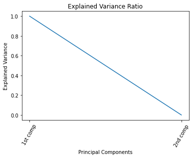

# FinTech HW2

## How to run

open `hw2.ipynb` in Jupyter Notebook and run all cells.

### Code Description

### Problem 1

使用FinMind的API去獲取TAIEX的資料

```python
api = DataLoader()
df = api.taiwan_stock_daily(
    stock_id='TAIEX',
    start_date='2012-12-01',
    end_date='2018-12-02'
)
df.drop(columns=['stock_id', 'Trading_money', 'spread', 'Trading_turnover'],inplace=True)
df.rename(columns={'Trading_Volume':'volume', 'max':'high', 'min':'low'},inplace=True)
```

### Problem 2

主要是後二十筆資料的處理比較特別，最後20筆資料後續不足20天，如果在剩餘的天數沒漲超過4%及沒跌破2%應該標記成nan

```python
label = []
for i in range(0, len(close_array)):
    length = len(close_array[i:])
    if length > 21:
        length = 21
    if length == 21:
        for j in range(0, length):
            upper_bound = close_array[i] * 1.04
            lower_bound = close_array[i] * 0.98
            if close_array[i+j] >= upper_bound:
                label.append(1)
                break
            elif close_array[i+j] <= lower_bound:
                label.append(2)
                break
        if len(label) != i+1:
            label.append(0)
    else:
        for j in range(0, length):
            upper_bound = close_array[i] * 1.04
            lower_bound = close_array[i] * 0.98
            if close_array[i+j] >= upper_bound:
                label.append(1)
                break
            elif close_array[i+j] <= lower_bound:
                label.append(2)
                break
        if len(label) != i+1:
            label.append(np.nan)
```

### Problem 3

使用tailib，算出作業所需的指標

```python
df['MA-5'] = (df['close'] - talib.MA(df.close, timeperiod=5, matype=0)) / talib.MA(df.close, timeperiod=5, matype=0)
df['MA-10'] = (df['close'] - talib.MA(df.close, timeperiod=10, matype=0)) / talib.MA(df.close, timeperiod=10, matype=0)
df['MA-20'] = (df['close'] - talib.MA(df.close, timeperiod=20, matype=0)) / talib.MA(df.close, timeperiod=20, matype=0)
df['MA-60'] = (df['close'] - talib.MA(df.close, timeperiod=60, matype=0)) / talib.MA(df.close, timeperiod=60, matype=0)
df['RSI-14'] = talib.RSI(df.close, timeperiod=14)
df['MACD'], df['MACD_signal'], df['MACD_hist'] = talib.MACD(df.close)
df.dropna(inplace=True)
```

### Problem 4

PCA

```python
pca = PCA(n_components=2, random_state=0)
pca.fit(df)
```

Explained Variance Ratio



Cumulative Explained Variance


畫圖

```python
index = 0
color = []
for i in df_pca:
    if y[index] == 0:
        color.append('red')
    elif y[index] == 1:
        color.append('green')
    else:
        color.append('blue')
    index += 1
colors = ['red', 'green', 'blue']
plt.xlabel('component 1')
plt.ylabel('component 2')
plt.scatter(df_pca[:,0], df_pca[:,1], c=color, edgecolor='none')
```


