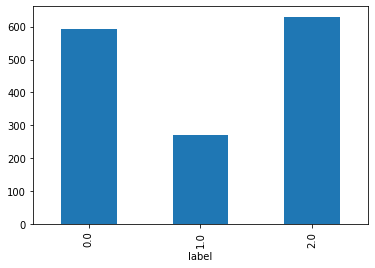
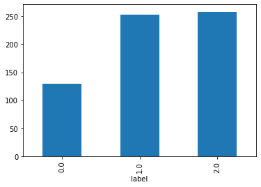
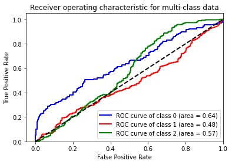

# FinTech HW3

## How to run

open `hw3.ipynb` in Jupyter Notebook and run all cells.

### Code Description

### Problem 1

#### A

使用FinMind的API去獲取TAIEX的資料

```python
api = DataLoader()
df = api.taiwan_stock_daily(
    stock_id='TAIEX',
    start_date='2012-12-01',
    end_date='2021-12-02'
)
df.drop(columns=['stock_id', 'Trading_money', 'spread', 'Trading_turnover'],inplace=True)
df.rename(columns={'Trading_Volume':'volume', 'max':'high', 'min':'low'},inplace=True)
```

#### B

主要是後二十筆資料的處理比較特別，最後20筆資料後續不足20天，如果在剩餘的天數沒漲超過4%及沒跌破2%應該標記成nan

```python
label = []
for i in range(0, len(close_array)):
    length = len(close_array[i:])
    if length > 21:
        length = 21
    if length == 21:
        for j in range(0, length):
            upper_bound = close_array[i] * 1.04
            lower_bound = close_array[i] * 0.98
            if close_array[i+j] >= upper_bound:
                label.append(1)
                break
            elif close_array[i+j] <= lower_bound:
                label.append(2)
                break
        if len(label) != i+1:
            label.append(0)
    else:
        for j in range(0, length):
            upper_bound = close_array[i] * 1.04
            lower_bound = close_array[i] * 0.98
            if close_array[i+j] >= upper_bound:
                label.append(1)
                break
            elif close_array[i+j] <= lower_bound:
                label.append(2)
                break
        if len(label) != i+1:
            label.append(np.nan)
```

#### C

使用tailib，算出作業所需的指標

```python
df['MA-5'] = (df['close'] - talib.MA(df.close, timeperiod=5, matype=0)) / talib.MA(df.close, timeperiod=5, matype=0)
df['MA-10'] = (df['close'] - talib.MA(df.close, timeperiod=10, matype=0)) / talib.MA(df.close, timeperiod=10, matype=0)
df['MA-20'] = (df['close'] - talib.MA(df.close, timeperiod=20, matype=0)) / talib.MA(df.close, timeperiod=20, matype=0)
df['MA-60'] = (df['close'] - talib.MA(df.close, timeperiod=60, matype=0)) / talib.MA(df.close, timeperiod=60, matype=0)
df['RSI-14'] = talib.RSI(df.close, timeperiod=14)
df['MACD'], df['MACD_signal'], df['MACD_hist'] = talib.MACD(df.close)
df.dropna(inplace=True)
```

### Problem 2

#### A

將後30%資料當成test data，前70%資料當成train data

```python
train = df[:int(df.shape[0] * 0.7)]
test = df[int(df.shape[0] * 0.7):]
```

#### B

將要跑的patameter放入一個dict

```python
param_dict = {
    'bootstrap': [True],
    'max_depth': [80, 90, 100, 110],
    'max_features': [2, 3],
    'min_samples_leaf': [3, 4, 5],
    'min_samples_split': [8, 10, 12],
    'n_estimators': [100, 200, 300, 1000]
}
```

#### C

利用groupby將每一個class分別做一個計量，並畫成一個柱狀圖

```python
train.groupby('label').count()['volume']
train.groupby('label').count()['volume'].plot(kind='bar')
test.groupby('label').count()['volume']
test.groupby('label').count()['volume'].plot(kind='bar')
```





#### D

使用GridSearchCV找出最佳參數組合，其中參數cv就是設定要用幾個fold

```python
model = GridSearchCV(RandomForestClassifier(), param_grid=param_dict, cv=3, return_train_score=True, n_jobs=4, verbose=3)
model.fit(X_train, y_train)
```

#### E

the best training score

```python
model.cv_results_['mean_train_score'].max()
```

the best parameters

```python
model.best_params_
```

the best testing score of best estimator

```python
best_test_score = model.best_estimator_.score(X_test, y_test)
best_test_score
```

#### F

y_score: 將model預測的結果轉成機率回傳
y_test: 使用label_binarize將test data整理成每個class分別是一個維度(test_data.shape[0], num_classes)

```python
y_score = model.predict_proba(X_test)
y_test = label_binarize(y_test, classes=[0, 1, 2])
```

計算每個class的False Positive Rate, True Positive Rate, Area Under the Curve

```python
fpr = dict()
tpr = dict()
roc_auc = dict()
for i in range(3):
    fpr[i], tpr[i], _ = roc_curve(y_test[:, i], y_score[:, i])
    roc_auc[i] = auc(fpr[i], tpr[i])
```

將每一個class的roc_curve畫成一個圖

```python
colors = ['blue', 'red', 'green']
for i, color in zip(range(3), colors):
    plt.plot(fpr[i], tpr[i], color=color, lw=2,
             label='ROC curve of class {0} (area = {1:0.2f})'
             ''.format(i, roc_auc[i]))
plt.plot([0, 1], [0, 1], 'k--', lw=2)
plt.xlim([-0.05, 1.0])
plt.ylim([0.0, 1.05])
plt.xlabel('False Positive Rate')
plt.ylabel('True Positive Rate')
plt.title('Receiver operating characteristic for multi-class data')
plt.legend(loc="lower right")
plt.show()
```


